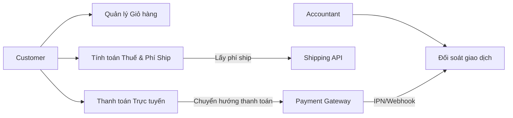

# SRS - 2.2. Giỏ hàng & Thanh toán
**Dự án:** Website E-commerce Kochi Lens
---

## Phần 1: Mô hình hóa quy trình (Business Flow)

### 1.1. Sơ đồ Use Case
Tập trung vào tương tác giữa khách hàng, hệ thống tính toán và các bên thứ ba (Đơn vị vận chuyển, Cổng thanh toán).

* **Customer:** Quản lý giỏ hàng, chọn đơn vị vận chuyển, thực hiện thanh toán.
* **Payment Gateway (VNPay/Momo):** Xác thực giao dịch và phản hồi trạng thái.
* **Shipping API:** Cung cấp phí ship dựa trên vị trí địa lý.
* **Accountant (Kế toán):** Kiểm tra đối soát tiền về từ cổng thanh toán.

```mermaid
usecaseDiagram
flowchart LR
    cus["Customer"] --> UC7["Quản lý Giỏ hàng"]
    cus --> UC8["Tính toán Thuế & Phí Ship"]
    cus --> UC9["Thanh toán Trực tuyến"]

    acc["Accountant"] --> UC10["Đối soát giao dịch"]

    UC8 -->|Lấy phí ship| ship["Shipping API"]
    UC9 -->|Chuyển hướng thanh toán| pg["Payment Gateway"]

    pg -->|IPN/Webhook| UC10
```

### 1.2. Sơ đồ Activity (Quy trình Thanh toán & Tích hợp)


---

## Phần 2: Đặc tả chức năng (Functional Requirements)

### 2.1. Giỏ hàng & Tính toán (Calculation)
* **US08:** Là một khách hàng, tôi muốn hệ thống tự động tính thuế $VAT$ dựa trên từng loại mặt hàng trong giỏ hàng để tôi biết chính xác số tiền thuế phải trả.
* **US09:** Là một khách hàng, tôi muốn hệ thống tính phí vận chuyển tự động ngay khi tôi nhập địa chỉ (Tỉnh/Thành, Quận/Huyện) để tránh phát sinh chi phí sau khi đặt hàng.
* **US10:** Là một khách hàng, tôi muốn áp dụng mã giảm giá (Coupon) và thấy tổng tiền thay đổi ngay lập tức trước khi thanh toán.

### 2.2. Thanh toán trực tuyến (Integration)
* **US11:** Là một khách hàng, tôi muốn thanh toán qua **VNPay (QR Code/ATM)** hoặc **Momo** để linh hoạt trong việc sử dụng các ứng dụng ngân hàng hoặc ví điện tử.
* **US12:** Là hệ thống, tôi phải tự động hủy lệnh "Khóa tồn kho" (Expire Reserved Stock) nếu khách hàng không hoàn tất thanh toán trong vòng 15 phút, để giải phóng hàng cho người khác.
* **US13:** Là một kế toán, tôi muốn hệ thống lưu trữ **Mã tham chiếu giao dịch (Transaction ID)** từ VNPay/Momo vào đơn hàng để tôi dễ dàng đối soát dòng tiền hàng tháng.

---

## Phần 3: Đặc tả dữ liệu (Data Schema)

Bổ sung các trường dữ liệu cần thiết cho việc tính toán và tích hợp cổng thanh toán.

### 3.1. Tax & Shipping (Bổ sung vào Order)
| Trường dữ liệu | Kiểu dữ liệu | Mô tả |
| :--- | :--- | :--- |
| `Sub_Total` | Decimal | Tổng tiền hàng (Chưa thuế, chưa ship). |
| `VAT_Amount` | Decimal | Tổng tiền thuế $VAT = \sum (Item\_Price \times VAT\_Rate)$. |
| `Shipping_Fee` | Decimal | Phí vận chuyển (Từ API đơn vị vận chuyển). |
| `Discount_Amount`| Decimal | Số tiền được giảm giá từ Coupon. |
| `Grand_Total` | Decimal | Tổng cộng cuối cùng khách phải trả. |

### 3.2. Payment Logs (Bản ghi thanh toán)
Lưu trữ để đối soát với VNPay/Momo.

| Trường dữ liệu | Kiểu dữ liệu | Mô tả |
| :--- | :--- | :--- |
| `Payment_ID` | String | ID giao dịch nội bộ. |
| `Order_Number` | String | Liên kết đơn hàng (FK). |
| `Provider` | Enum | `VNPAY`, `MOMO`, `COD`. |
| `Provider_Trans_ID`| String | Mã giao dịch từ phía Cổng thanh toán cung cấp. |
| `Payment_Status` | Enum | `Pending`, `Success`, `Failed`, `Refunded`. |
| `Paid_At` | Timestamp | Thời điểm thanh toán thành công. |

### 3.3. Shipping Info (Thông tin vận chuyển)
| Trường dữ liệu | Kiểu dữ liệu | Mô tả |
| :--- | :--- | :--- |
| `Province_ID` | String | Mã Tỉnh/Thành phố (Theo chuẩn API vận chuyển). |
| `District_ID` | String | Mã Quận/Huyện. |
| `Carrier_Code` | String | Đơn vị vận chuyển (GHTK, GHN, Viettel Post...). |
| `Tracking_Number` | String | Mã vận đơn (Cập nhật sau khi kho giao hàng). |