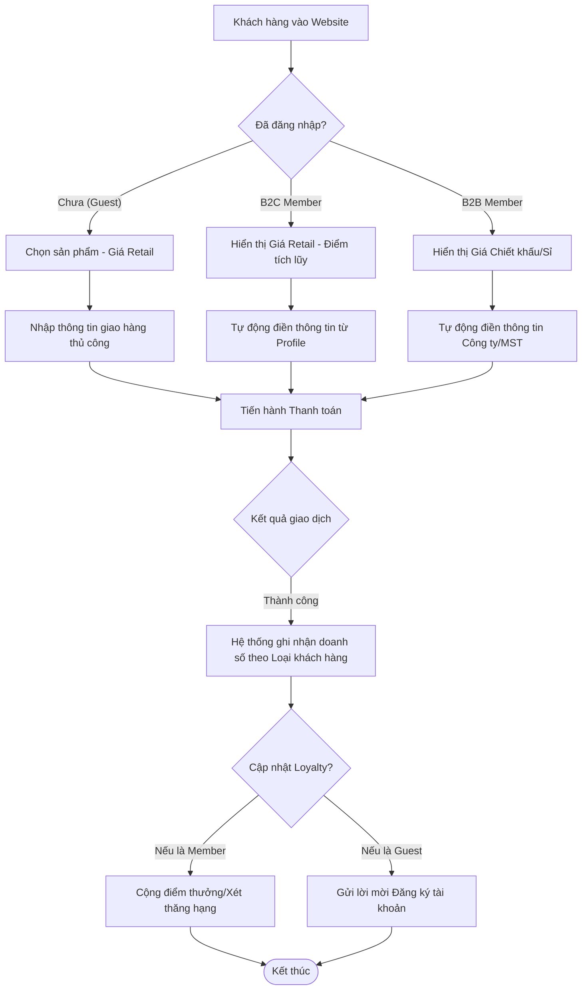

# SRS - 2.3. Quản lý Khách hàng (CRM)
**Dự án:** Website E-commerce Kochi Lens
---
## Phần 1: Mô hình hóa quy trình (Business Flow)

### 1.1. Sơ đồ Use Case
Phân quyền và hành vi giữa các nhóm khách hàng khác nhau nhằm tối ưu hóa trải nghiệm mua sắm và quản lý bán hàng.

* **Guest (Khách vãng lai):** Mua hàng không cần tài khoản, chỉ cung cấp thông tin giao nhận tối thiểu.
* **B2C Member (Khách cá nhân):** Có tài khoản, tích điểm loyalty, xem lịch sử đơn hàng.
* **B2B Member (Khách doanh nghiệp/Đại lý):** Có chính sách giá riêng, quản lý công nợ, yêu cầu hóa đơn VAT mặc định.
* **Admin:** Phê duyệt tài khoản B2B, quản lý nhóm khách hàng và phân hạng (Rank).

```mermaid
usecaseDiagram
    actor "Guest" as guest
    actor "B2C Member" as b2c
    actor "B2B Member" as b2b
    actor "Admin" as adm

    package "Customer Management System" {
        usecase "Đặt hàng nhanh (Checkout as Guest)" as UC11
        usecase "Đăng ký/Đăng nhập & Tích điểm" as UC12
        usecase "Xem bảng giá chiết khấu B2B" as UC13
        usecase "Quản lý thông tin Xuất hóa đơn" as UC14
        usecase "Phân nhóm & Phê duyệt B2B" as UC15
    }

    guest --> UC11
    b2c --> UC12
    b2c --> UC14
    b2b --> UC12
    b2b --> UC13
    b2b --> UC14
    adm --> UC15
```

### 1.2. Sơ đồ Activity (Phân luồng khách hàng khi đặt hàng)



---

## Phần 2: Đặc tả chức năng (Functional Requirements)

### 2.1. Đối với Khách vãng lai (Guest)
* **US14:** Là một khách vãng lai, tôi muốn đặt hàng mà không cần đăng ký tài khoản để quá trình mua sắm diễn ra nhanh chóng.
* **US15:** Là một khách vãng lai, tôi muốn hệ thống gợi ý tạo tài khoản sau khi đặt hàng thành công (dựa trên Email/SĐT đã nhập) để tôi có thể theo dõi hành trình đơn hàng.

### 2.2. Đối với Khách thành viên (B2C)
* **US16:** Là một khách hàng B2C, tôi muốn lưu trữ nhiều địa chỉ giao hàng trong tài khoản để dễ dàng chọn lựa khi mua quà tặng cho người thân.
* **US17:** Là một khách hàng B2C, tôi muốn tích điểm dựa trên giá trị đơn hàng để đổi voucher giảm giá cho các lần mua sau.

### 2.3. Đối với Khách doanh nghiệp / Đại lý (B2B)
* **US18:** Là một khách hàng B2B, tôi muốn được hiển thị bảng giá riêng (đã chiết khấu) ngay khi đăng nhập để thực hiện đặt hàng số lượng lớn mà không cần thương lượng lại.
* **US19:** Là một khách hàng B2B, tôi muốn hệ thống lưu sẵn thông tin Mã số thuế và Địa chỉ văn phòng để mỗi đơn hàng đều tự động được xuất hóa đơn VAT chính xác.
* **US20:** Là một Admin, tôi muốn có quyền phê duyệt yêu cầu nâng cấp tài khoản từ B2C lên B2B sau khi đã kiểm tra giấy phép kinh doanh của họ.

---

## Phần 3: Đặc tả dữ liệu (Data Schema)

Để phân biệt các luồng khách hàng, cấu trúc bảng `Partner` cần bổ sung các thuộc tính về phân loại và chính sách giá.

### 3.1. Partner Profile (Mở rộng từ phần 2.1)
| Trường dữ liệu | Kiểu dữ liệu | Mô tả |
| :--- | :--- | :--- |
| `Partner_Type` | Enum | `GUEST`, `B2C`, `B2B`. |
| `Customer_Rank` | String | Hạng thành viên (Silver, Gold, Platinum...). |
| `Loyalty_Points` | Integer | Số điểm tích lũy hiện có. |
| `Price_List_ID` | String | ID bảng giá áp dụng (Mặc định: Retail; B2B: Wholesale). |
| `Business_License`| String/URL | Ảnh chụp giấy phép kinh doanh (Chỉ dành cho B2B). |
| `Is_Verified` | Boolean | Trạng thái Admin đã phê duyệt tài khoản B2B hay chưa. |

### 3.2. Customer Address Book (Số địa chỉ)
| Trường dữ liệu | Kiểu dữ liệu | Mô tả |
| :--- | :--- | :--- |
| `Address_ID` | String | Mã định danh địa chỉ. |
| `Partner_ID` | String | Liên kết với khách hàng (FK). |
| `Receiver_Name` | String | Tên người nhận hàng. |
| `Is_Default` | Boolean | Địa chỉ mặc định khi đặt hàng. |
| `Address_Type` | Enum | `Home`, `Office`, `Billing` (Hóa đơn). |

### 3.3. B2B Credit Limit (Hạn mức công nợ - Tùy chọn nâng cao)
| Trường dữ liệu | Kiểu dữ liệu | Mô tả |
| :--- | :--- | :--- |
| `Credit_Limit` | Decimal | Số tiền tối đa khách B2B được nợ. |
| `Current_Debt` | Decimal | Số nợ hiện tại. |
| `Payment_Terms` | String | Điều khoản thanh toán (Ví dụ: Net 30 - Thanh toán trong 30 ngày). |