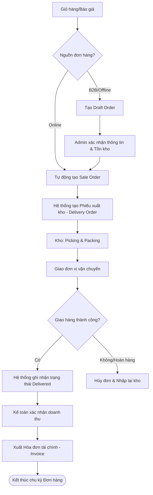

---

# SRS - 2.4. Xử lý Đơn hàng (OMS)
**Dự án:** Website E-commerce Kochi Lens

## Phần 1: Mô hình hóa quy trình (Business Flow)

### 1.1. Sơ đồ Use Case
Mô tả sự phối hợp liên phòng ban để hoàn tất một đơn hàng từ khi còn là bản nháp đến khi xuất hóa đơn.

* **Admin/Sales:** Tạo và xác nhận đơn hàng (Draft -> Sale Order).
* **Warehouse Staff:** Tiếp nhận lệnh xuất kho và thực hiện giao hàng (Delivery).
* **Accountant:** Kiểm tra thanh toán và xuất hóa đơn tài chính (Invoice).
* **Customer:** Theo dõi trạng thái đơn hàng từ phía giao diện web.

```mermaid
usecaseDiagram
    actor "Admin/Sales" as sales
    actor "Warehouse Staff" as whs
    actor "Accountant" as acc
    actor "Customer" as cus

    package "Order Management System (OMS)" {
        usecase "Quản lý Draft Order" as UC16
        usecase "Xác nhận Sale Order" as UC17
        usecase "Xử lý Giao hàng (Delivery)" as UC18
        usecase "Xuất hóa đơn (Invoice)" as UC19
        usecase "Theo dõi vận đơn" as UC20
    }

    sales --> UC16
    sales --> UC17
    whs --> UC18
    acc --> UC19
    cus --> UC20
```

### 1.2. Sơ đồ Activity (Luồng xử lý đơn hàng chi tiết)



---

## Phần 2: Đặc tả chức năng (Functional Requirements)

### 2.1. Quản lý Đơn hàng Nháp (Draft Order)
* **US21:** Là một nhân viên Sales, tôi muốn tạo đơn hàng nháp (Draft Order) cho khách hàng B2B sau khi thương lượng giá, để chờ khách hàng xác nhận lại trước khi trừ tồn kho thực tế.
* **US22:** Là hệ thống, tôi sẽ tự động chuyển các giỏ hàng bị bỏ quên (Abandoned Cart) thành trạng thái Draft để bộ phận Telesale có thể theo dõi và hỗ trợ khách hàng.

### 2.2. Xác nhận Đơn hàng (Sale Order)
* **US23:** Là một Admin, tôi muốn chuyển trạng thái từ Draft sang Sale Order để chính thức ghi nhận doanh số và gửi lệnh xuống bộ phận kho.

### 2.3. Giao hàng & Hóa đơn (Delivery & Invoice)
* **US24:** Là một nhân viên kho, tôi muốn in "Phiếu soạn hàng" (Picking List) từ đơn hàng Sale Order để biết chính xác vị trí và số lượng thiết bị cần lấy trong kho.
* **US25:** Là một nhân viên kế toán, tôi muốn hệ thống tự động gom các đơn hàng đã giao thành công để xuất hóa đơn điện tử hàng loạt.

---

## Phần 3: Đặc tả dữ liệu (Data Schema)

### 3.1. Order Status (Trạng thái Đơn hàng)
| Trạng thái | Ý nghĩa |
| :--- | :--- |
| `Draft` | Đơn hàng nháp, chưa trừ tồn kho. |
| `Confirmed` | Đã xác nhận thanh toán/mua hàng. |
| `Processing` | Kho đang thực hiện lấy hàng và đóng gói. |
| `Shipped` | Đã giao cho đơn vị vận chuyển. |
| `Delivered` | Giao hàng thành công. |
| `Cancelled` | Đơn bị hủy, hoàn tồn kho. |

### 3.2. Delivery Object (Thông tin Giao hàng)
| Trường dữ liệu | Kiểu dữ liệu | Mô tả |
| :--- | :--- | :--- |
| `Delivery_ID` | String | Mã phiếu xuất kho. |
| `Order_ID` | String | Liên kết với Sale Order (FK). |
| `Shipping_Method`| String | GHTK, Viettel Post, v.v. |
| `Tracking_No` | String | Mã vận đơn. |

### 3.3. Invoice Object (Hóa đơn)
| Trường dữ liệu | Kiểu dữ liệu | Mô tả |
| :--- | :--- | :--- |
| `Invoice_No` | String | Số hóa đơn tài chính. |
| `Total_Amount` | Decimal | Tổng giá trị thanh toán cuối cùng. |
| `Tax_Date` | Date | Ngày ký hóa đơn. |