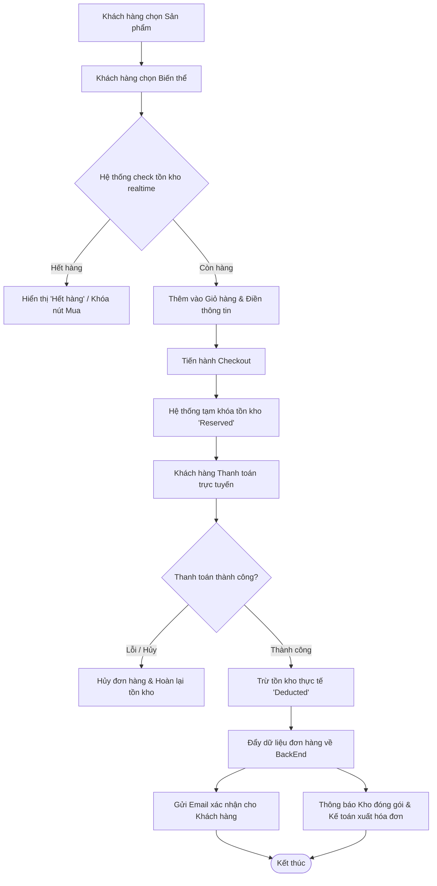

# Đặc tả Yêu cầu Hệ thống (SRS) 
**Tính năng:** 2.1. Quản lý Sản phẩm (PIM) - Quản lý biến thể và Tồn kho realtime
**Dự án:** Website E-commerce Kochi Lens

---

## Phần 1: Mô hình hóa quy trình (Business Flow)

### 1.1. Sơ đồ Use Case
Xác định quyền hạn và tương tác của các đối tượng (Actors) với hệ thống.

* **Admin (Quản trị viên / Kế toán):** Quản lý sản phẩm gốc, biến thể (SKU, Màu sắc, Ngàm ống kính), theo dõi tồn kho và xuất hóa đơn.
* **Customer (Khách hàng):** Xem sản phẩm, kiểm tra tồn kho realtime, thêm vào giỏ hàng và thanh toán.
* **Warehouse Staff (Nhân viên kho):** Nhận đơn hàng mới đổ về và cập nhật trạng thái đóng gói.

```mermaid
usecaseDiagram
    actor Customer
    actor Admin
    actor WarehouseStaff as Warehouse Staff

    package "Kochi Lens System" {
        usecase UC1 as "Xem sản phẩm & Tồn kho realtime"
        usecase UC2 as "Chọn biến thể & Đặt hàng"
        usecase UC3 as "Thanh toán"
        usecase UC4 as "Quản lý Sản phẩm & Biến thể"
        usecase UC5 as "Cập nhật Tồn kho"
        usecase UC6 as "Đóng gói đơn hàng"
    }

    Customer --> UC1
    Customer --> UC2
    Customer --> UC3
    Admin --> UC4
    Admin --> UC5
    WarehouseStaff --> UC6
    UC2 ..> UC5 : <<Trigger trừ tồn kho tạm thời>>
```

### 1.2. Sơ đồ Activity (Luồng đặt hàng)
Mô tả luồng từ lúc khách hàng chọn sản phẩm đến khi thanh toán thành công, dữ liệu đổ về BackEnd.



---

## Phần 2: Đặc tả chức năng (Functional Requirements)

### 2.1. Quản lý Sản phẩm (PIM)
* **US01:** Là một Admin, tôi muốn tạo một sản phẩm gốc và thêm nhiều biến thể (Màu sắc, kích thước/ngàm) để quản lý chung một dòng sản phẩm gọn gàng hơn.
* **US02:** Là một Admin, tôi muốn thiết lập mã SKU, Barcode, Giá bán và Thuế VAT riêng cho từng biến thể để hệ thống tính toán và kế toán đối soát chính xác.

### 2.2. Quản lý Tồn kho Real-time & Đặt hàng
* **US03:** Là một khách hàng, tôi muốn thấy số lượng tồn kho hiển thị ngay lập tức khi chọn một biến thể để biết sản phẩm còn sẵn hàng hay không.
* **US04:** Là hệ thống, tôi muốn tạm khóa (reserve) tồn kho ngay khi khách hàng vào bước thanh toán, để tránh việc 2 khách hàng cùng mua 1 sản phẩm cuối cùng (Over-selling).
* **US05:** Là một khách hàng, tôi muốn nhận được email xác nhận đơn hàng ngay sau khi thanh toán để tôi an tâm về giao dịch.

### 2.3. Xử lý BackEnd (Kho & Kế toán)
* **US06:** Là một nhân viên kho, tôi muốn đơn hàng thanh toán thành công tự động đổ về BackEnd ở trạng thái "Confirmed" để tôi in phiếu xuất kho và đóng gói.
* **US07:** Là một nhân viên kế toán, tôi muốn xem được thông tin Công ty và MST do khách hàng nhập để tiến hành xuất hóa đơn VAT.

---

## Phần 3: Đặc tả dữ liệu (Data Schema)

Các bảng dữ liệu cốt lõi để đáp ứng luồng mua hàng và quản lý biến thể.

### 3.1. Partner (Khách hàng)
| Trường dữ liệu | Kiểu dữ liệu | Mô tả |
| :--- | :--- | :--- |
| `Partner_ID` | String | Mã định danh khách hàng (PK). |
| `Full_Name` | String | Tên đầy đủ của khách hàng. |
| `Email` | String | Email để gửi thông báo xác nhận. |
| `Delivery_Address` | String | Địa chỉ giao hàng. |
| `Company_Name` | String | Tên công ty (Dùng cho hóa đơn). |
| `Tax_Code` | String | Mã số thuế (MST). |

### 3.2. Product (Biến thể sản phẩm)
| Trường dữ liệu | Kiểu dữ liệu | Mô tả |
| :--- | :--- | :--- |
| `Variant_ID` | String | Mã định danh biến thể (PK). |
| `SKU` | String | Mã SKU nội bộ. |
| `Barcode` | String | Mã vạch cho bộ phận kho. |
| `Attributes` | JSON | Các thuộc tính biến thể (VD: `{Color: Black, Mount: E-mount}`). |
| `Price` | Decimal | Giá bán hiện tại. |
| `VAT_Rate` | Decimal | Mức thuế VAT (%). |
| `Stock_Available` | Integer | Số lượng tồn kho có thể bán (Realtime). |

### 3.3. Order (Đơn hàng)
| Trường dữ liệu | Kiểu dữ liệu | Mô tả |
| :--- | :--- | :--- |
| `Order_Number` | String | Số đơn hàng hiển thị (VD: ORD-001). |
| `Partner_ID` | String | Khách hàng đặt đơn (FK). |
| `Status` | Enum | `Draft`, `Confirmed` (Kho đã nhận), `Cancelled`. |
| `Order_Lines` | Array | Chứa danh sách `Variant_ID`, số lượng, giá tiền. |
| `Total_Amount` | Decimal | Tổng giá trị đơn hàng (Đã gồm VAT). |